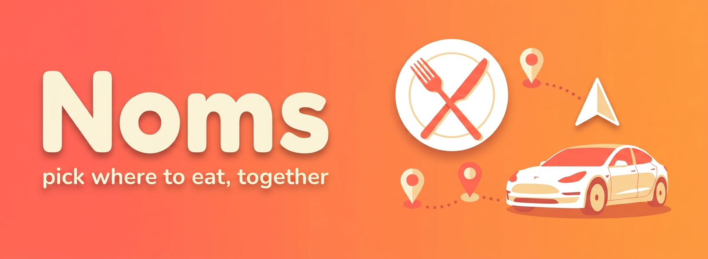

<p align="center">
  
</p>

<p align="center">
  <a href="https://github.com/johnpc/jpc-noms/actions/workflows/ci.yml"></a>
  
</p>

# Noms

**Pick where to eat, together.** Noms is a two-person app for deciding where to go out. Search
restaurants, save your favorites to a shared **rotation**, and start a **nom** — a collaborative
shortlist you and your partner build together. Either of you can add options; the other gets a push
notification the moment you do. When one of you marks a pick as **selected**, it sets the navigation
on your Tesla automatically.

Browse restaurants instantly — no account required. Sign in and pair with your partner to nominate
together.

## What makes it different

- 🍽️ **Noms are shared and collaborative.** A nom belongs to _both_ of you. Add a restaurant from
  either phone and it shows up live on the other.
- 🔔 **Real push notifications.** Your partner adds Joe's Pizza to tonight's nom → your phone buzzes.
- 🚗 **Winner routes to the car.** Mark a nom selected and Noms sends the restaurant's address to your
  Tesla's navigation (via Tessie) — no copy-paste, no "what's the address again?".
- 👫 **Pair once.** Set up your household of two; every nom is automatically shared between you.

## Features

| Feature                                 | Status |
| --------------------------------------- | ------ |
| Guest-browsable restaurant search       | ✅     |
| Save favorites to a rotation            | ⬜     |
| Fixed partner pairing                   | ⬜     |
| Collaborative noms (add / select, live) | ⬜     |
| APNs push on partner activity           | ⬜     |
| Tesla navigation on selection           | ⬜     |

## Stack

Ionic 8 + React 19 + TypeScript (strict) + Vite + Capacitor (iOS), on AWS Amplify Gen2 (Cognito +
AppSync + DynamoDB). Restaurant data comes from the Google Places API; the Tesla hand-off runs through
a DynamoDB-stream Lambda calling the Tessie API. Architecture, quality gates, and CI descend from the
[stoop](https://github.com/johnpc/stoop) / [spork](https://github.com/johnpc/spork) reference apps.

## Setup

```bash
git clone git@github.com:johnpc/jpc-noms.git
cd jpc-noms
npm install
cp .env.example .env      # add your Google Places + Tessie keys
AWS_PROFILE=personal npx ampx sandbox   # deploy a personal backend
npm run e2e-config        # pull amplify_outputs.json from the sandbox
npm run dev               # http://localhost:5173
```

## Quality

Every commit passes the full gate (husky pre-commit + CI): no `any`, ≤100-line logic files, ≥80% test
coverage, CRAP ≤15, Prettier clean, Gherkin acceptance tests (Playwright + playwright-bdd), and a green
build. See `CLAUDE.md` for the working agreement and architecture.
